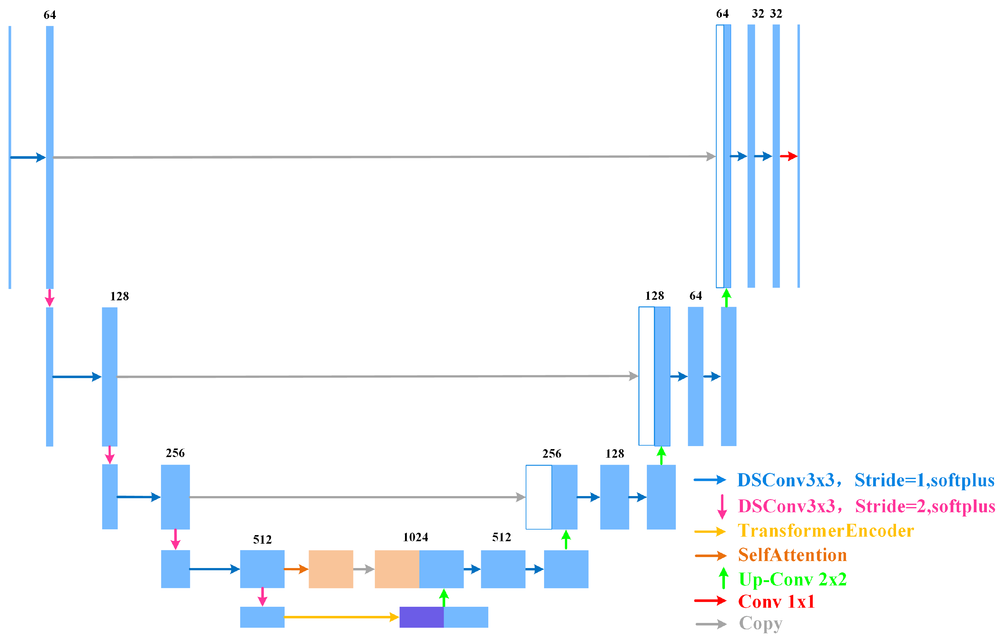
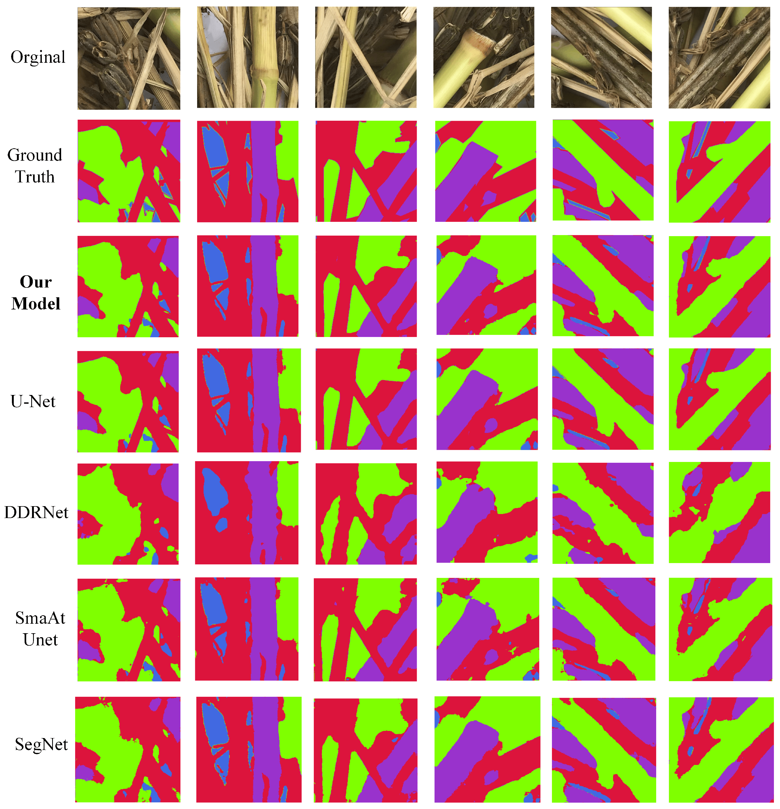

# Introduce
[U-Net Semantic Segmentation-Based Calorific Value Estimation of Straw Multifuels for Combined Heat and Power Generation Processes](https://www.mdpi.com/1996-1073/17/20/5143)

## Functions
* It introduces a self-attention mechanism in the skip connections to enhance the extraction of key information from deep features;
* It replaces traditional convolutions with depthwise separable convolutions to reduce the model’s computational complexity and improve inference speed;
* It substitutes the bottleneck layer with a Transformer encoder to leverage the global modeling capabilities of Transformers, allowing the model to better understand contextual information within the image.

## Model Architecture

## Result

## Env set
* cuda               11.8
* python             3.8.0
* conda create --name StrawSeg python=3.8.0
* Detail please reference requierment.txt

## About author
* warren@伟
* Blog：[CSDN](https://blog.csdn.net/warren103098?type=blog)